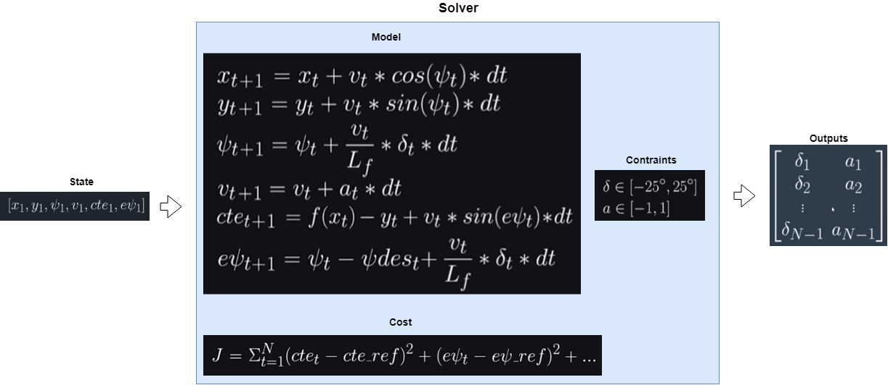

# CarND-Controls-MPC
Self-Driving Car Engineer Nanodegree Program

---

## Control model
 In this project a kinematic model is deployed to control a car on the lake track. To keep the simplicity complex interactions, like tire forces or slipping forces are neglected. The architecture of a model predictive controller is shown below:
 


where:

State parameters

 * x, y: Car position
 * psi: actual direction
 * v: velocity
 * cte: Cross-Track error
 * epsi: Orientation error
 
 Conrol inputs(actuation):
 
 * a: acceleration
 * delta: steering angle
 
The model predictive control optimizes control inputs [delta, a] regarding to cost function, which is sum of quadratic errors of CTE and psi.
 
## Timestep Length and Elapsed Duration

Number of timesteps N and elapsed time dt determine the prediction horizon. The number of timesteps have a big impact on the stability of the controller. With a number of timesteps smaller than 5, the controller is completely oscillating. The same result was also observed with a number of timesteps bigger than 15. One more thing was observed during tuning N is that the car acceleration is increasing when the number of timesteps increases. After trying with N in range from 5 to 15 and timestep in range from 50 to 100 milliseconds, I choose 10 timesteps and 100 ms steptime to have a good stability of the controller.

## Polynomial Fitting and MPC Preprocessing
The waypoints provided by the simulation is transformed into car coordination system as below

```
/* shift car reference angle to 90 degree*/ 
for (uint_t i = 0; i < ptsx.size(); i++)
{
   double shift_x = ptsx[i] - px;
   double shift_y = ptsy[i] - py;
   ptsx[i] = (shift_x * cos(0 - psi) - shift_y * sin( 0 - psi));
   ptsy[i] = (shift_x * sin(0 - psi) + shift_y * cos( 0 - psi));
}
Eigen::Map<Eigen::VectorXd> ptsx_transform(&ptsx[0], 6);
Eigen::Map<Eigen::VectorXd> ptsy_transform(&ptsy[0], 6);
```

Then they are fitted to a third order polynomial

```
auto coeffs = polyfit(ptsx_transform, ptsy_transform, 3);
```

## Model Predictive Control with Latency

To deal with the latency of actuation, a small delay is implemented to predict the system state after the latency, which is new initail state for MPC. The prediction of new state after latency is implemented as followed:

```
/* Actuator delay in milliseconds.*/
const int actuatorDelay = 100;

/* Actuator delay in seconds.*/
const double delay = actuatorDelay / 1000.0;
		  
/* Initial state.*/
const double x0 = 0;
const double y0 = 0;
const double psi0 = 0;
const double cte0 = coeffs[0];
const double epsi0 = -atan(coeffs[1]);

/* State after delay.*/
double x_delay = x0 + ( v * cos(psi0) * delay );
double y_delay = y0 + ( v * sin(psi0) * delay );
double psi_delay = psi0 - ( v * delta * delay / mpc.Lf );
double v_delay = v + a * delay;
double cte_delay = cte0 + ( v * sin(epsi0) * delay );
double epsi_delay = epsi0 - ( v * atan(coeffs[1]) * delay / mpc.Lf );

/* Define the state vector.*/
Eigen::VectorXd state(6);
state << x_delay, y_delay, psi_delay, v_delay, cte_delay, epsi_delay;
```


 
  
 
 
